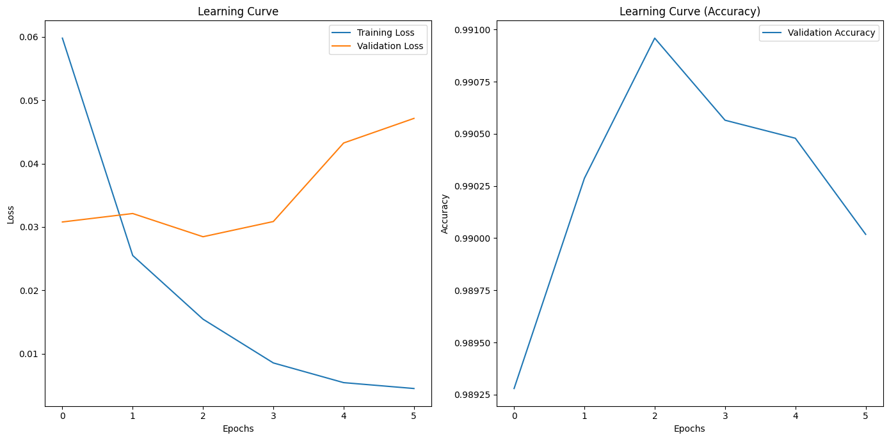

# malicious url detection with bert model
---
## info
- pretrained: DistilBertForSequenceClassification
- dataset: https://www.kaggle.com/datasets/sid321axn/malicious-urls-dataset
- hyperparameters
  * train batch size=128
  * valid batch size=64
  * optimizer: AdamW
  * learning rate=5e-5
  * mixture of floating point
  * accumulation steps=4
  * padding
  * early stopping
  * checkpoint
- hardware
  * colab A100
  
**Model Performance**

| Metric        | Precision | Recall | F1-Score | Support |
|---------------|-----------|--------|----------|---------|
| **Class 0**   | 0.99      | 0.99   | 0.99     | 85,621  |
| **Class 1**   | 0.99      | 0.98   | 0.99     | 44,618  |
|               |           |        |          |         |
| **Accuracy**  |           |        | **0.99** | 130,239 |
| **Macro Avg** | 0.99      | 0.99   | 0.99     | 130,239 |
| **Weighted Avg** | 0.99   | 0.99   | 0.99     | 130,239 |

**Confusion Matrix**

|               | Predicted 0 | Predicted 1 |
|---------------|-------------|-------------|
| **Actual 0**  | 85,088      | 533         |
| **Actual 1**  | 684         | 43,934      |

**Overall Accuracy**: 0.9906556407834827

